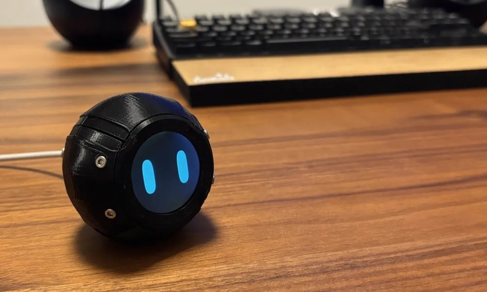

# Q mini

[](./README.md)
[](./README_JA.md)





## 目次
1. [**Q mini の概要**](#q-mini-の概要)  
   1. [特徴](#特徴)  
   2. [使用デバイス](#使用デバイス)

2. [**開発環境のセットアップ**](#開発環境のセットアップ)  
   1. [RP2040-LCD-1.28 の準備](#rp2040-lcd-128-の準備)  
   2. [FFmpeg のインストール](#ffmpeg-のインストール)

3. [**表情データの作成と変換**](#表情データの作成と変換)  
   1. [PowerPointでの表情アニメーション作成](#powerpointでの表情アニメーション作成)  
   2. [動画から画像へ変換](#動画から画像へ変換)  
   3. [画像からrawデータへ変換](#画像からrawデータへ変換)  
   4. [C言語ヘッダファイルへの変換](#c言語ヘッダファイルへの変換)


## Q mini の概要
Q mini は、円形ディスプレイ付きの小型ロボットで、表情を滑らかに表示することで親しみやすいインターフェースを実現します。本リポジトリでは、Windows環境を前提とした開発手順と表情の作成・表示方法をまとめています。
Q mini は、Waveshare社の RP2040-LCD-1.28 ボードをベースに、PowerPointで作成した表情アニメーションを再生できる小型ロボットです。ロボット本体にLCDを組み込み、温かみのあるインターフェースを実現します。

### 特徴
- 円形LCDディスプレイで表情を表示
- PowerPointで簡単に表情アニメーションを作成可能
- Windows上での開発に最適化
- オープンソースで誰でも再現可能

### 使用デバイス
- [Waveshare RP2040-LCD-1.28](https://www.waveshare.com/wiki/RP2040-LCD-1.28)
  - 解像度: 240x240 px
  - 円形1.28インチLCD搭載
  - RP2040マイコン内蔵


## 開発環境のセットアップ

### RP2040-LCD-1.28 の準備
セットアップ手順は以下を参照してください：

- [Waveshare公式 Wiki](https://www.waveshare.com/wiki/RP2040-LCD-1.28)
- [使い方の解説（日本語）](https://cotechworks.ltt.jp/2024/04/17/post-1463/)

### FFmpeg のインストール
画像変換に必要な FFmpeg を Windows にインストールします。

```
$ winget install --id=Gyan.FFmpeg -e
```


## 表情データの作成と変換

### PowerPointでの表情アニメーション作成
1. PowerPointのアニメーション機能を使って、表情の変化を作成します。
2. スライドショーを録画し、**mp4形式**で出力してください。
3. 解像度は最低限 `480x480` を推奨します。

### 動画から画像へ変換
動画を `240x240` の正方形BMP画像に分割します（30fps）。

```
$ ffmpeg -i face_blink.mp4 -vf "fps=30,scale=240:240" frame%04d.bmp
```

### 画像からrawデータへ変換
各BMP画像を `RGB565` の生データに変換します。以下は例です（6枚の場合）:

```
$ for %i in (1 2 3 4 5 6) do ffmpeg -i frame000%i.bmp -f rawvideo -pix_fmt rgb565 frame000%i.raw
```

### C言語ヘッダファイルへの変換
変換した `.raw` ファイルをヘッダーファイルにします。
生成された `.h` ファイルを以下の形式に修正してください。

```cpp
#pragma once 
#include <Arduino.h>
const uint8_t frame1[] PROGMEM = {
  0x1F, 0x7C, 0x00, 0xFF, ..., // RGB565形式のデータ列
};
```

すべてのフレームに対してこれを繰り返してください。


## ライセンス
このプロジェクトは〇〇ライセンスのもと公開されています。詳細はLICENSEファイルをご覧ください。

## 貢献方法
誰でもこのプロジェクトに貢献できます！
バグの報告、プルリクエスト、ドキュメントの改善など、お待ちしています。

---

[トップに戻る](#リポジトリテンプレート)
